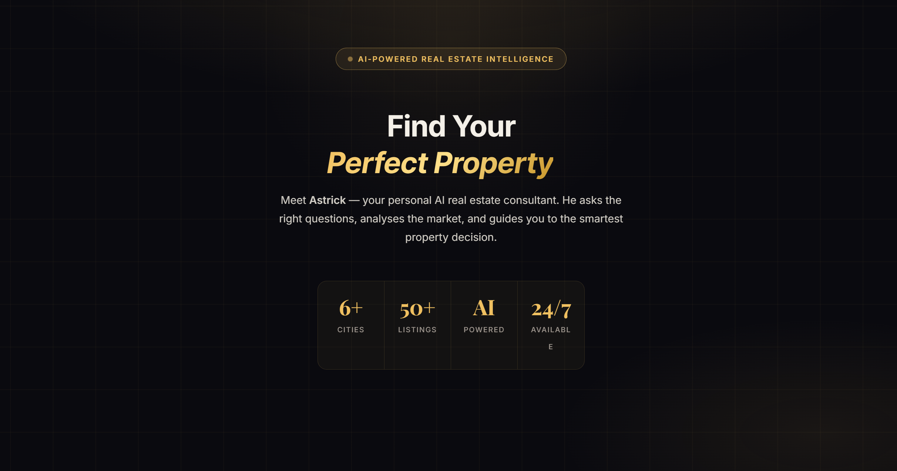
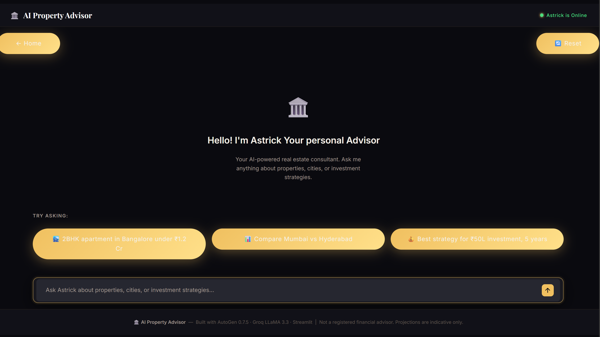

# 🏛️ AI Property Advisor

> A production-ready, resume-worthy **AI real estate consulting agent** that doesn't just answer — it **guides, compares, and remembers**.

Built with **AutoGen 0.7.5**, **Groq LLaMA3**, **Tavily (real-time search)**, and **Streamlit UI**.


---

## ✨ What Makes This Project Special?

Unlike basic chatbots, this AI agent behaves like a **real consultant**:

| Feature | Description |
|---|---|
| 🧠 Intent Understanding | Asks about budget, city, and purpose before advising |
| 📊 Structured + Live Data | Uses internal tools AND real-time web search |
| 🌐 Tavily Integration | Fetches latest prices, trends & infrastructure news |
| 🏠 Smart Recommendations | Suggests properties based on ROI + lifestyle fit |
| 🔁 Memory System | Remembers user preferences across the conversation |
| ⚖️ Honest Trade-offs | Explains pros/cons instead of overselling |

---

## 📁 Project Structure

```
ai_property_advisor/
├── app.py                    ← Streamlit app (landing + chat UI)
├── requirements.txt
├── .env.example
├── .gitignore
│
├── .streamlit/
│   └── config.toml
│
├── config/
│   └── settings.py           ← API keys + model config
│
├── agent/
│   ├── system_prompt.py      ← Consultant persona (core brain)
│   └── advisor_agent.py      ← AutoGen agent setup
│
└── tools/
    └── property_tools.py     ← All tools (search, compare, recommend)
```

---

## ⚙️ Setup Instructions

### Prerequisites

- Python 3.10+
- [Groq API Key](https://console.groq.com/keys)
- [Tavily API Key](https://app.tavily.com)

---

### Step 1 — Clone the Repository

```bash
git clone <repo-url>
cd ai_property_advisor
```

### Step 2 — Create a Virtual Environment

```bash
python -m venv .venv

# macOS / Linux
source .venv/bin/activate

# Windows
.venv\Scripts\activate
```

### Step 3 — Install Dependencies

```bash
pip install -r requirements.txt
```

### Step 4 — Configure Environment Variables

```bash
cp .env.example .env
```

Open `.env` and fill in your keys:

```env
GROQ_API_KEY=your_groq_api_key
GROQ_MODEL=llama-3.3-70b-versatile

TAVILY_API_KEY=your_tavily_api_key
```

### Step 5 — Run the App

```bash
streamlit run app.py
```

App runs at 👉 **http://localhost:8501**

---

## Visual views





## 🚀 How It Works

### Intelligent Conversation Flow

```
1. Understand  →  Ask about budget, city, and purpose
2. Store       →  Save preferences using memory
3. Decide Tool →  Select the correct tool for the query
4. Fetch Data  →  Use internal tools or Tavily web search
5. Advise      →  Deliver structured, data-backed recommendations
```

### 🛠️ Tools — Core Intelligence Layer

| Tool | Purpose |
|---|---|
| `recommend_property` | Suggest properties based on budget & city |
| `compare_locations` | Compare cities with ROI & livability scores |
| `investment_advice` | Strategy + projected returns |
| `web_search` | 🌐 Fetch real-time data via Tavily |
| `update_user_profile` | Store user preferences in memory |
| `get_user_profile` | Retrieve stored preferences |

---

## 🌐 Tavily Integration

Tavily gives the AI **real-world awareness** by searching the live web.

**Used for:**
- 📈 Latest property prices (2025–2026)
- 🏙️ Market trends & city growth insights
- 🏗️ Infrastructure & development updates
- 💰 Rental yield & demand changes

| | Without Tavily ❌ | With Tavily ✅ |
|---|---|---|
| **Knowledge** | Static, outdated | Real-time, current |
| **Answers** | May be inaccurate | Data-backed |
| **Trust** | Low | High |

---

## 💬 Example Conversation

```
User: What is the current land price in Noida in 2026?

Agent: [Calls web_search → Tavily]

📍 Location Insights:
  - Sector 150:       ₹5,000 – ₹6,500 / sq ft
  - Noida Extension:  ₹4,800 – ₹6,500 / sq ft
  - Premium Sectors:  ₹8,000+ / sq ft

📈 Market Trends:
  - 10–12% YoY growth driven by infrastructure upgrades
  - High demand from IT professionals & NCR migration

💡 Recommendation:
  Mid-sectors (137–150) offer the best balance of
  long-term growth and current affordability.
```

---

## 🧠 Memory System

The agent remembers user preferences throughout the session:

- 💰 Budget
- 📍 Preferred city
- 🏠 Property type
- 🎯 Investment or personal use

These are displayed in the UI as **memory chips** for quick reference.

---

## 🎨 Frontend Highlights

- Premium dark luxury UI design
- Hero landing page with branding
- ChatGPT-style chat interface
- Quick suggestion prompt buttons
- Persistent in-session memory display
- Fully custom CSS (no default Streamlit styling)

---

## 🏗️ Architecture

```
User (Streamlit UI)
        │
        ▼
AutoGen AssistantAgent
        │
        ├── Groq LLaMA3 70B  (LLM reasoning)
        │
        └── Tools Layer
              ├── recommend_property
              ├── compare_locations
              ├── investment_advice
              ├── web_search  (Tavily 🌐)
              ├── update_user_profile
              └── get_user_profile
```

---

## 📊 Why This Project Stands Out

| Capability | Details |
|---|---|
| ✅ Multi-tool AI Agent | Not just a chat wrapper — uses structured tools |
| ✅ Real-time Web Integration | Tavily fetches live market data |
| ✅ Memory-Aware Conversations | Preferences persist across turns |
| ✅ Structured Decision-Making | Understand → Store → Decide → Fetch → Advise |
| ✅ Production-Grade UI | Streamlit + custom CSS |
| ✅ Clean Architecture | Separated UI / Agent / Tools layers |

---

## 🔮 Future Improvements

### Intelligence
- [ ] Real estate APIs (MagicBricks, 99acres)
- [ ] Rental yield datasets
- [ ] EMI calculator tool

### AI System
- [ ] Multi-agent architecture (Researcher + Advisor agents)
- [ ] Vector DB memory (Chroma / Qdrant)

### Frontend
- [ ] Downloadable PDF property reports
- [ ] Interactive side-by-side comparison tables
- [ ] Map integration for location visualization

### Production
- [ ] User authentication & login
- [ ] PostgreSQL for persistent storage
- [ ] Cloud deployment (AWS / Railway)

---

## ⚠️ Disclaimer

This AI provides **indicative insights only**.  
It is **not** a SEBI-registered financial advisor.  
Always verify data independently before making any investment decisions.

---

## 📝 License

This project is licensed under the **MIT License** — free to use and modify.

---

## ❤️ Built With

[AutoGen](https://github.com/microsoft/autogen) · [Groq](https://groq.com) · [Tavily](https://tavily.com) · [Streamlit](https://streamlit.io)

> Designed to feel like a **real estate consultant** — not just a chatbot.